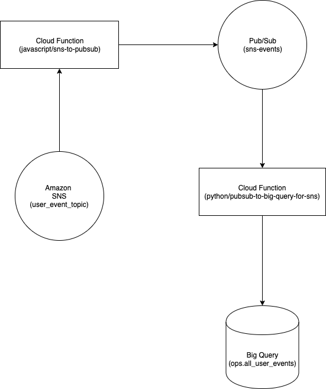
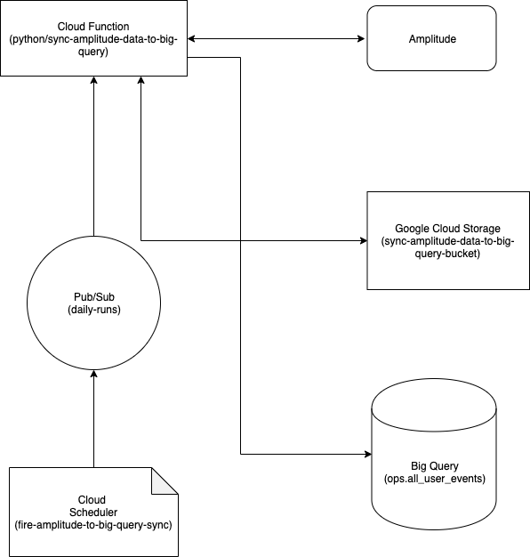
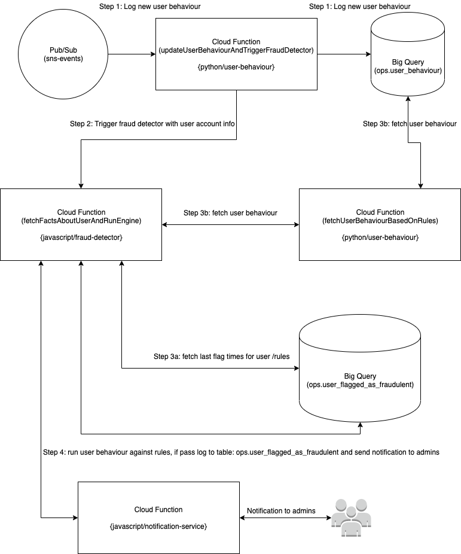

# Jupiter Data

## Purpose
This repository contains functions that handle our data infrastructure on GCP.

At the moment data is being pulled from [Amazon SNS (Simple Notification Service)](https://aws.amazon.com/sns/) and [Amplitude](https://amplitude.com/)
into [Google Cloud Platform (GCP)](https://cloud.google.com/gcp)

The data is to be used for generate insights to drive decisions using analytics tools and machine learning on GCP.


## Important Notes
At the moment all data pulled from external sources (our accounts on Amazon and Amplitude) are stored in Google's `Big Query`.

On GCP our projects urls are: 

`staging project url` is: [console.cloud.google.com/home/dashboard?project=jupiter-ml-alpha](console.cloud.google.com/home/dashboard?project=jupiter-ml-alpha)

`production project url` is: [console.cloud.google.com/home/dashboard?project=jupiter-production-258809](console.cloud.google.com/home/dashboard?project=jupiter-production-258809)

Cloud infrastructure for Staging is located in the `US` while Production is located in `Europe`.

Terraform is used to manage our infrastructure on GCP
 
We run a serverless architecture which means our codebase is divided into functions which serve different purposes.

The functions in this repository are located in the `functions` folder. Within the functions folder, these functions
are sub-divided into `javascript` and `python` folders and this represents the language they are written in.
The functions are:

JavaScript:
- `javascript/sns-to-pubsub`: receives events from Amazon SNS and publishes it to Google Pub/Sub topic: `sns-events`
- `javascript/fetch-from-big-query`: fetch amplitude data from big query
- `javascript/notification-service`: sends email notifications with given message to given users
- `javascript/fraud-detector`: runs a set of custom rules against user behaviour to determine if user is dodgy

Python: 
- `python/pubsub-to-big-query-for-sns`: takes sns events from Pub/Sub and stores into big query table: `all_user_events`
- `python/sync-amplitude-data-to-big-query`: downloads data daily from Amplitude and stores into big query table: `all_user_events` 
- `python/funnel-analysis`: checks for drop offs / recovery users  
- `python/user-behaviour`: updates user behaviour when there is an event on `sns-events` topic and retrieves user behaviour 


The functions above are all cloud functions on GCP.

Now to how the whole thing works:

## Data Inflow from Amazon
Our Amazon infrastructure holds our core operational data i.e. user login, user savings event etc.
To pipe the data from Amazon to GCP, the `javascript/sns-to-pubsub` function subscribes to Amazon's SNS topic: `staging_user_event_topic` (for staging) and `master_user_event_topic` (for production)
using a https endpoint, when SNS receives a new message, SNS pushes that message to `javascript/sns-to-pubsub`, 
on receiving the message `javascript/sns-to-pubsub` publishes said message to GCP's Pub/Sub topic: `sns-events`.

`N/B`: SNS and Pub/Subs are message brokers

We have a second function `python/pubsub-to-big-query-for-sns` that is subscribed to the Pub/Sub topic: `sns-events`.
When there is a new message on `sns-events`, `python/pubsub-to-big-query-for-sns` receives that message and loads the
message into the Big Query table `ops.all_user_events`

This entire flow is best explained with the diagram below:

Amazon SNS => `javascript/sns-to-pubsub` => Pub/Sub => `python/pubsub-to-big-query-for-sns` => Big Query

Endpoints for `javascript/sns-to-pubsub` (which are the endpoints that SNS pushes to) are:
Staging Endpoint: [https://us-central1-jupiter-ml-alpha.cloudfunctions.net/sns-to-pubsub](https://us-central1-jupiter-ml-alpha.cloudfunctions.net/sns-to-pubsub)
Production Endpoint:  [https://europe-west1-jupiter-production-258809.cloudfunctions.net/sns-to-pubsub](https://europe-west1-jupiter-production-258809.cloudfunctions.net/sns-to-pubsub)

Diagram of Data flow from Amazon




## Data Inflow from Amplitude
Our Amplitude account holds data about events carried out by a customer of Jupiter Save. Events include:
`user opening the app`, `user exiting the app`, `user payment succeeding` and so much more.

Amplitude provides an API to export a compressed file containing all the events that have occurred during a day.

Our current flow involves running a script at 3am (GMT) every day that pulls the Amplitude data for the previous day from when the script is running. The script that syncs data from amplitude is: `python/sync-amplitude-data-to-big-query` 

To trigger `python/sync-amplitude-data-to-big-query`, we have a cloud scheduler function: `fire-amplitude-to-big-query-sync` 
that sends a message to Pub/Sub topic `daily-runs` at 3am every day. The `python/sync-amplitude-data-to-big-query` 
function is subscribed to the Pub/Sub topic `daily-runs` and starts syncing amplitude data to big query for the 
previous day on receiving the message from `daily-runs`.

On receiving the data from Amplitude, `python/sync-amplitude-data-to-big-query` transforms the data and stores a copy of it in google cloud storage 
and then loads the data into Big Query table `ops.all_user_events`

Again the entire flow is best explained with the diagram below:

Diagram of Data flow from Amplitude




## Fetch From Amplitude
We now have data from Amazon and Amplitude in Google's Big Query. Here in comes the `javascript/fetch-from-big-query`
which helps us interact with the data in Big Query. `javascript/fetch-from-big-query` serves to fetch data from big query.
At the moment it fetches only Amplitude data, but it could be extended to fetch more diverse data.

Endpoints for `javascript/fetch-from-big-query` are:
Staging Endpoint: [https://us-central1-jupiter-ml-alpha.cloudfunctions.net/fetch-from-big-query](https://us-central1-jupiter-ml-alpha.cloudfunctions.net/fetch-from-big-query )
Production Endpoint:  [https://europe-west1-jupiter-production-258809.cloudfunctions.net/fetch-from-big-query](https://europe-west1-jupiter-production-258809.cloudfunctions.net/fetch-from-big-query)


## Fraud Detection
We would like to detect dodgy users. Users that are suspected to have made fraudulent transactions.
Our architecture involves 4 different functions in order to achieve this.

The flow of fraud detection starts with the `python/user-behaviour` folder which contain two functions in one file.
The `update_user_behaviour_and_trigger_fraud_detector` (referred to as: `update user behaviour`) and `fetch_user_behaviour_based_on_rules` 
(referred to as: `fetch user behaviour`) functions.

Step 1: **`update user behaviour` logs new user behaviour**. 
The `update user behaviour` is triggered by a new event on the `sns-events` topic
(indicating a new user transaction), `update user behaviour` proceeds to log the user's new 
transaction to the big query table: `ops.user_behaviour`.

Step 2: **`update user behaviour` triggers fraud detector**. 
`update user behaviour` then triggers the fraud detector via a http POST request with body 
of the request as the user account info: `userId` and `accountId`.


Step 3(a): **`fraud detector` retrieves the last flag times for user/rules** .
The `javascript/fraud-detector` has the entry point: `fetchFactsAboutUserAndRunEngine` (referred to as: `fraud detector`).
On receiving the POST request with the user account details from the `update user behaviour`
function, the `fraud detector` retrieves the last time a user was flagged for the 
various rules we have in the `javascript/fraud-detector/custom-rules.js` from the big query table: 
`ops.user_flagged_as_fraudulent` table. These last flag times are then used to fetch facts about user behaviour 
by sending a http POST request to the `fetch user behaviour` with the user account info and the last flag times for rules.

Step 3(b): **`fraud detector` retrieves the user behaviour from `fetch user behaviour`** .
On receiving the http POST request from `fraud-detector`, `fetch user behaviour` fetches the user behaviour 
based on the aforementioned custom rules and last flag times. `fetch user behaviour` fetches the user 
behaviour from the table: `user_behaviour`, it then returns the response to the `fraud-detector`.

Step 4: **`fraud detector` runs user behaviour against rules** . 
On receiving the response from `fetch user behaviour`, `fraud detector` runs the received user behaviour against the 
predefined custom rules located in : `javascript/fraud-detector/custom-rules.js`.
If any of the rules are passed by the received user behaviour, then the `fraud-detector` logs a flag to the 
big query table: `user_flagged_as_fraudulent` indicating that the user is fraudulent. 
Email Notifications are also sent to JupiterSave admins via a POST request to the notification service.

If `verbose mode` is set to `true`, an email notification is sent via the notification service indicating that the 
fraud detector ran.

When an error occurs during the fraud detection process, an email notification is sent via the notification service 
indicating that an error occurred during fraud detection.

Fraud detector can be explained with a diagram showing the steps involved:

Diagram of flow of Fraud Detection




No http endpoint is exposed for `user behaviour`'s first function => `update_user_behaviour_and_trigger_fraud_detector` 
(`python/user-behaviour`) as the function is triggered by the Pub/Sub topic: `sns-events`
 
Http Endpoints for `fraud detector` function => `fetchFactsAboutUserAndRunEngine` (`javascript/fraud-detector`): 
Staging Endpoint: [https://us-central1-jupiter-ml-alpha.cloudfunctions.net/fraud-detector](https://us-central1-jupiter-ml-alpha.cloudfunctions.net/fraud-detector)
Production Endpoint: [https://europe-west1-jupiter-production-258809.cloudfunctions.net/fraud-detector](https://europe-west1-jupiter-production-258809.cloudfunctions.net/fraud-detector)


Http Endpoints for `user behaviour`'s second function =>`fetch_user_behaviour_based_on_rules` (`python/user-behaviour`):
Staging Endpoint: [https://us-central1-jupiter-ml-alpha.cloudfunctions.net/fetch-user-behaviour-based-on-rules](https://us-central1-jupiter-ml-alpha.cloudfunctions.net/fetch-user-behaviour-based-on-rules)
Production Endpoint: [https://europe-west1-jupiter-production-258809.cloudfunctions.net/fetch-user-behaviour-based-on-rules](https://europe-west1-jupiter-production-258809.cloudfunctions.net/fetch-user-behaviour-based-on-rules) 


Http Endpoints for the `notification service` (`javascript/notification-service`): 
Staging Endpoint: [https://us-central1-jupiter-ml-alpha.cloudfunctions.net/notification-service ](https://us-central1-jupiter-ml-alpha.cloudfunctions.net/notification-service)
Production Endpoint: [https://europe-west1-jupiter-production-258809.cloudfunctions.net/notification-service](https://europe-west1-jupiter-production-258809.cloudfunctions.net/notification-service)


## Funnel Analysis
Funnel analysis is used to analyse the `all_user_events` to find the users that have dropped off or recovered while
using the JupiterSave mobile app.


## Google and Amplitude Credentials
The service account, environment variables and secrets used to access Google and Amplitude's infrastructure is supplied 
via [Circle CI's](https://circleci.com/gh/luke-jordan/jupiter-data/edit#env-vars) environment variables.   


## Terraform State
The terraform state files for `staging` and `production` are stored in the staging bucket: `gs://staging-terraform-state-bucket`.


## Links to Draw.io Images
In case you want to update the diagrams above, here are links to the draw.io files so you can edit the diagrams and update the images easily.

1. [Data Inflow from Amazon](docs/raw_xml/diagram_of_data_flow_from_amazon.xml)
2. [Data Inflow from Amplitude](docs/raw_xml/diagram_of_data_flow_from_amplitude.xml)
2. [Fraud Detection Process](docs/raw_xml/diagram_of_fraud_detection_process.xml)

## Creating a new JavaScript function
We have a sample function folder for javascript. Run the following command from the home directory of the repo to create a new javascript function following the sample function's format:
```
cp -R functions/javascript/sample-js-function/ functions/javascript/{name_of_new_function}/
```

`N/B`: Please replace the `{name_of_new_function}` with the name of the new function you are creating.


## Creating a new Python Function
1. Create your function folder in `functions/python`.
2. Check what environment you are in. Run the following command from the terminal: 
```
pip3 freeze
``` 

(You should see a bunch of installed python libraries).

3. Launch virtual environment. Run the following command from the terminal:
```
pipenv shell
```

4. Verify which environment we are in. Run the following command from the terminal:
```
pip3 freeze
``` 

(The result would be empty i.e. no pyhton libraries as this is a newly created virtual environment).

5. Install new libraries. To install single libraries, run the following command from the terminal:
```
pipenv install {library_name}
``` 
`N/B`: Please replace `{library_name}` with the name of the library you want to install e.g. `django`

To install libraries from an existing `Pipfile`, simply run the following command from the terminal:
```
pipenv install
``` 

That is all as per setup. You can now proceed to write your function and install needed libraries as you go from within the virtual environment.


## Python Tests
### Adding the test libraries to a python function
1. Launch virtual environment. Run the following command from the terminal:
```
pipenv shell
```

2. To install the python testing tool:
```
pipenv install pytest
```

3. To install the python test coverage tool:
```
pipenv install coverage
```

4. To install the python mock tool:
```
pipenv install mock
```


### Running Tests
Instructions for tests and test coverage in python functions i.e. functions in the folder: `functions/python`
1. To run the tests:
```
pytest
```

1. To run a single test:
```
pytest -k {test_name}
```

2. To run the tests with code coverage:
```
coverage run -m --source=. pytest && coverage report
```